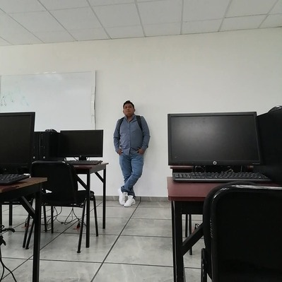

# Feli_Normar — Sitio Web Profesional

Sitio web personal y de servicios tecnológicos de **Felipe Norberto**, Ingeniero en Sistemas Computacionales egresado del Tecnológico Nacional de México, Campus Tuxtepec.

> Reparación de celulares, PC e impresoras · Desbloqueo FRP · Liberación de red · Soporte remoto global

🌐 **Demo en vivo:** [https://tu-usuario.github.io/feli-normar](https://tu-usuario.github.io/feli-normar)

---

## Estructura del proyecto

```
feli-normar/
├── assets/
│   ├── img/                  # Imágenes y avatar
│   │   ├── avatar.jpg        # Tu foto de perfil (200×200 px mínimo)
│   │   └── og-image.jpg      # Imagen para redes sociales (1200×630 px)
│   └── css/
│       └── shared.css        # Estilos globales compartidos
├── pages/
│   ├── servicios.html        # Servicios locales
│   ├── remoto.html           # Servicios remotos / FRP
│   └── feli_normar.html      # Página principal completa (all-in-one)
├── index.html                # Página de inicio (requerida por GitHub Pages)
├── .gitignore
└── README.md
```

---

## Cómo cambiar las imágenes

### Avatar / Foto de perfil

1. Prepara tu foto en formato `.jpg` o `.webp`, mínimo **200×200 px** (recomendado 400×400 px, cuadrada).
2. Nómbrala `avatar.jpg` y colócala en `assets/img/`.
3. En `index.html`, busca el bloque del avatar y reemplaza:

```html
<!-- ANTES (placeholder) -->
<div class="avatar-placeholder">
  <i class="fas fa-user-circle"></i>
  <span>Agrega tu foto aquí</span>
</div>

<!-- DESPUÉS (con tu foto) -->

```

### Imagen Open Graph (redes sociales)

Cuando alguien comparte tu sitio en WhatsApp, Facebook o Twitter, se muestra una imagen de vista previa. Para personalizarla:

1. Crea una imagen de **1200×630 px** con tu logo o diseño.
2. Guárdala como `assets/img/og-image.jpg`.
3. Agrega en el `<head>` de `index.html`:

```html
<meta property="og:image" content="https://tu-usuario.github.io/feli-normar/assets/img/og-image.jpg">
```

---

## Despliegue en GitHub Pages

```bash
# 1. Inicializa el repositorio
git init
git add .
git commit -m "feat: sitio inicial Feli_Normar"

# 2. Crea el repo en GitHub y conecta
git remote add origin https://github.com/tu-usuario/feli-normar.git
git branch -M main
git push -u origin main

# 3. Activa GitHub Pages
# Ve a: Settings → Pages → Source: Deploy from branch → main → / (root)
```

El sitio estará disponible en `https://tu-usuario.github.io/feli-normar/` en unos minutos.

---

## Tecnologías usadas

- HTML5 semántico
- CSS3 con variables personalizadas (sin frameworks)
- Font Awesome 6.5 (iconos)
- Google Fonts — Exo 2 + Nunito
- JavaScript vanilla (menú móvil, animaciones scroll)

---

## Personalización rápida

| Qué cambiar | Dónde |
|---|---|
| Número de WhatsApp | Busca `522831156502` en todos los `.html` |
| Correo electrónico | Busca `[email]` en `index.html` |
| Colores principales | Variables en `assets/css/shared.css` (`:root`) |
| Foto de perfil | `assets/img/avatar.jpg` (ver instrucciones arriba) |
| Nombre en footer | Busca `Felipe Norberto` en los `.html` |

---

## Licencia

© 2026 **Felipe Norberto** · Feli_Normar · Todos los derechos reservados.  
Prohibida la reproducción total o parcial sin autorización expresa del autor.
